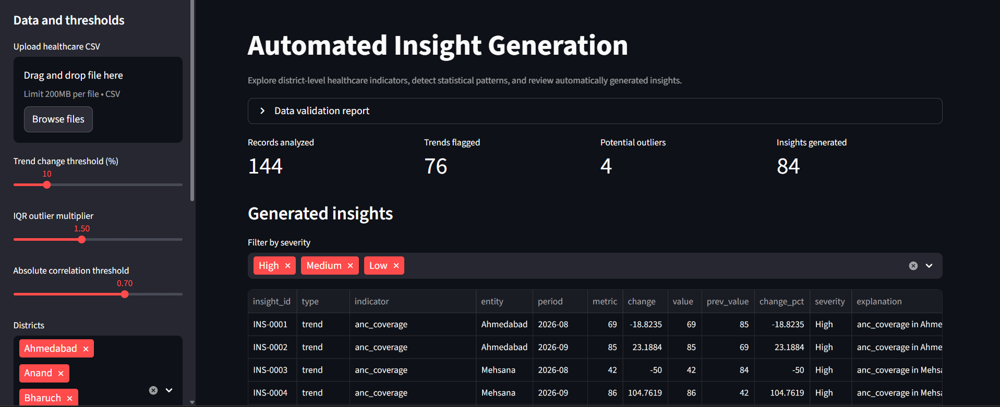
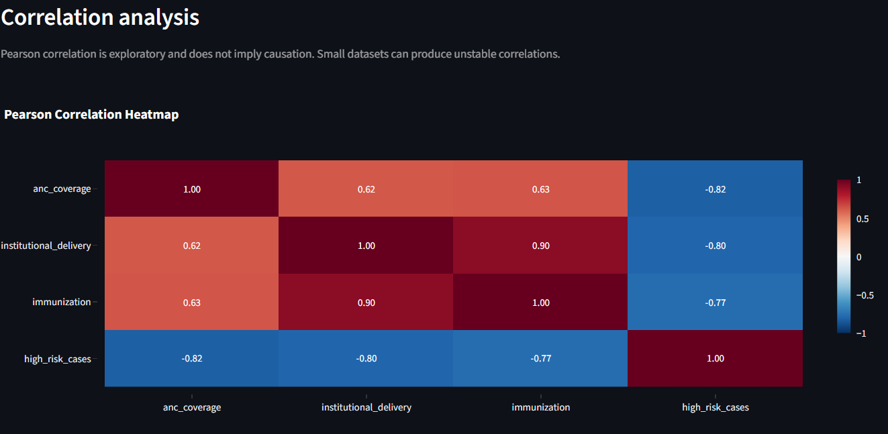
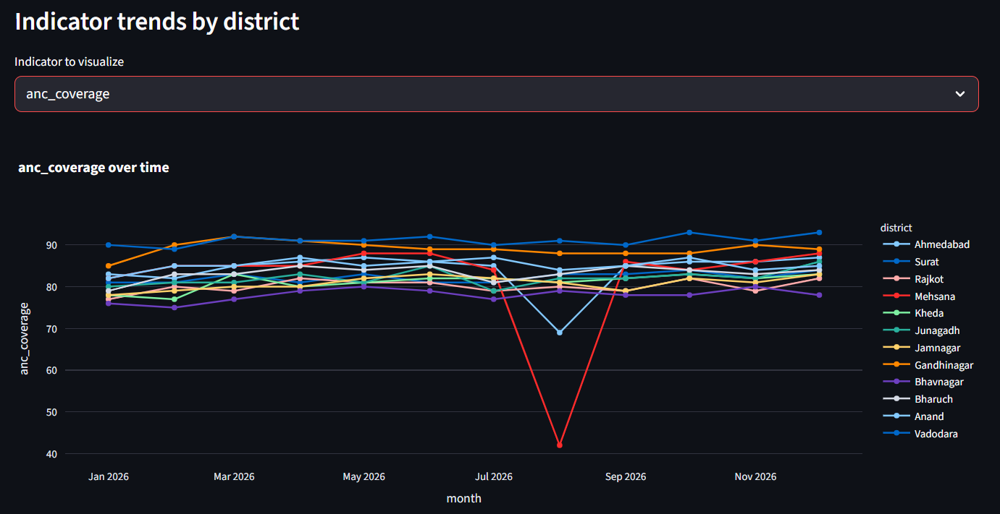
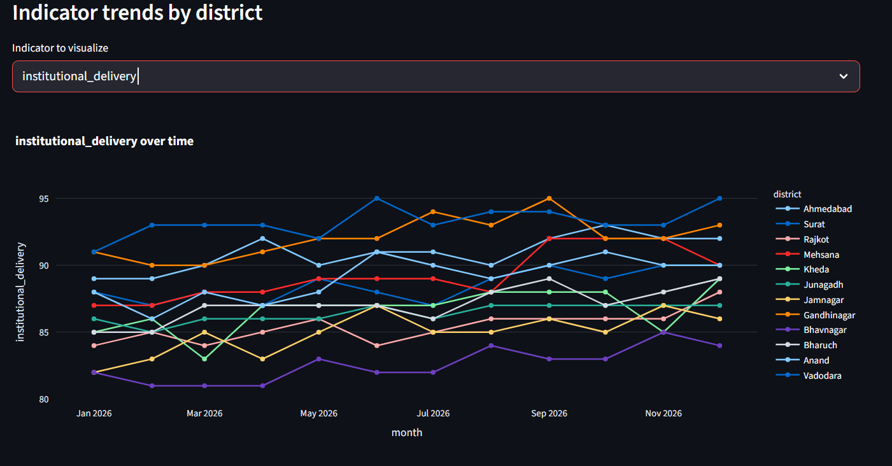
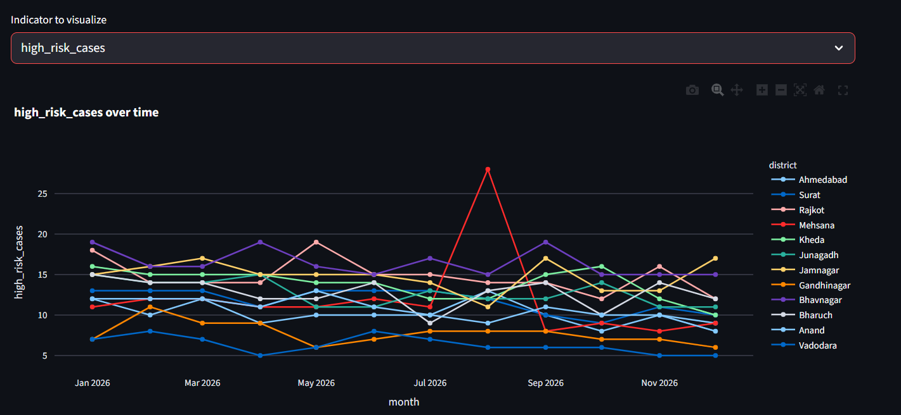

# Automated Insight Generation

A lightweight Python and Streamlit application that analyzes district-level healthcare indicator data and generates structured insights about monthly changes, statistical outliers, and correlations.

## Features

- CSV upload with schema validation and a data quality report
- District, month, and indicator filters
- Configurable trend, IQR outlier, and correlation thresholds
- Month-over-month trend detection
- IQR-based outlier screening
- Pearson correlation matrix and threshold-based pair detection
- Structured insights with values, periods, explanations, and severity
- Interactive Plotly charts
- CSV and JSON downloads

## Technology choices

- **Pandas** handles CSV loading, data validation, grouping, and tabular analysis.
- **NumPy** supports numerical calculations and missing-value handling.
- **Streamlit** provides the upload control, filters, threshold sliders, insight table, and downloads without a separate API server.
- **Plotly** provides interactive charts and a correlation heatmap.

The task asks for statistical pattern detection, not a predictive machine-learning model. Therefore, the core solution uses transparent statistical methods instead of adding an unnecessary model or paid generative AI API.

## How it works

```text
CSV upload / bundled sample
          |
          v
Schema validation and preprocessing
          |
          v
Trend detection | IQR outliers | Pearson correlations
          |
          v
Structured insight generation
          |
          v
Streamlit filters, tables, charts, and downloads
```

### Analytical methods

**Trends:** Compare each district and indicator with its previous available month. Flag absolute percentage changes at or above the configured threshold. Percentage change is undefined when the previous value is zero or missing.

**Outliers:** Apply the IQR rule separately to each selected indicator. Flagged values are candidates for review, not automatically incorrect records.

**Correlations:** Calculate Pearson correlation between numerical indicators and flag unique pairs when the absolute correlation meets the selected threshold. Correlation does not imply causation.

**Severity:** The example policy marks a trend High when its absolute change is at least 1.5 times the trend threshold, and Medium when it meets the threshold but remains below that level. Outliers and correlations are Medium by default. These are human-defined review priorities, not clinical risk standards.

## Dataset

`healthcare_performance_expanded.csv` contains 144 rows for 12 districts over 12 months. The original assignment sample values were preserved where included, and additional rows were generated synthetically for testing.

**Important:** The added rows are synthetic practice data, not official healthcare statistics. Do not use this dataset to draw real-world healthcare conclusions.

Expected columns:

- `month`
- `district`
- `anc_coverage`
- `institutional_delivery`
- `immunization`
- `high_risk_cases`

The first three indicators are treated as percentages for range checking. `high_risk_cases` is treated as a count.

## Run locally

Python 3.10 or later is recommended.

1. Clone or download this repository.
2. Open a terminal in the project folder.
3. Create and activate a virtual environment if desired.

Windows:

```bash
python -m venv .venv
.venv\Scripts\activate
```

macOS/Linux:

```bash
python -m venv .venv
source .venv/bin/activate
```

4. Install dependencies:

```bash
pip install -r requirements.txt
```

5. Start the application:

```bash
streamlit run app.py
```

Streamlit prints a local URL, usually `http://localhost:8501`. Open it in a browser. The bundled CSV loads by default; use the sidebar uploader to try another compatible CSV.

## Deliverables

- `app.py`: application and analytical functions
- `requirements.txt`: Python dependencies
- `healthcare_performance_expanded.csv`: practice dataset
- `sample_insights.json`: example structured output
- `screenshots/`: place actual screenshots here after running the app

## Project Structure and File Responsibilities

```text
automated-insight-generation/
├── app.py
├── automated_insight_generation.ipynb
├── healthcare_performance_expanded.csv
├── requirements.txt
├── sample_insights.json
├── README.md
├── .gitignore
├── screenshots/
│   ├── dashboard.png
│   ├── insights_table.png
│   ├── insights_by_severity.png
│   ├── correlation_analysis.png
│   ├── anc_coverage.png
│   ├── institutional_delivery.png
│   ├── immunization.png
│   └── high_risk_cases.png
└── outputs/
```

| File or folder | Responsibility |
|---|---|
| `app.py` | Main Streamlit application. Loads and validates the CSV, applies filters and configurable thresholds, calls the trend, outlier, correlation, and insight-generation functions, displays interactive Plotly charts, and provides CSV/JSON downloads. |
| `automated_insight_generation.ipynb` | Exploratory notebook that explains the analysis step by step, including data quality checks, preprocessing, visual exploration, statistical calculations, insight generation, and CSV exports. |
| `healthcare_performance_expanded.csv` | Bundled practice dataset used when no upload is supplied. It contains monthly records for multiple districts and healthcare indicators. Additional rows are synthetic and are not official healthcare statistics. |
| `requirements.txt` | Lists the Python packages needed to run the Streamlit application. Install them with `pip install -r requirements.txt`. |
| `sample_insights.json` | Example of the structured insight format, showing fields such as insight ID, type, indicator, district, period, values, percentage change, severity, and explanation. It is a sample output, not a live result from the current dashboard filters. |
| `README.md` | Project overview, analytical methods, calculation formulas, design decisions, setup instructions, limitations, and screenshot documentation. |
| `.gitignore` | Excludes local virtual environments, Python cache files, and local Streamlit secrets from Git. |
| `screenshots/` | Actual screenshots of the running dashboard, insights table, severity chart, correlation heatmap, and district-level indicator trends. Referenced by relative paths in this README. |
| `outputs/` | Intended location for CSV exports created when running the notebook. The Streamlit app also lets users download results directly through the browser. |

### Where the main logic lives

The main application is intentionally kept in `app.py` so the reviewer can follow the execution path in one place:

1. `load_and_validate()` loads the uploaded or bundled CSV and reports data quality issues.
2. `detect_trends()` identifies month-over-month percentage changes that meet the selected threshold.
3. `detect_outliers()` applies the IQR rule to selected indicators.
4. `detect_correlations()` computes the Pearson correlation matrix and flags qualifying pairs.
5. `generate_insights()` converts findings into structured records with explanations and severity.
6. The Streamlit interface applies filters, displays tables and Plotly charts, and provides downloads.

The notebook repeats the core analysis in a more educational, step-by-step format. It is useful for reviewing and explaining the calculations, while `app.py` is the entry point for the interactive application.

## Screenshots

The following screenshots show the running Streamlit dashboard using the bundled practice dataset.

### 1. Dashboard and filters

The main dashboard shows the uploaded or bundled dataset, configurable thresholds, district/month/indicator filters, and summary counts.



### 2. Generated insights

The insights table shows structured findings with their type, indicator, district, period, current and previous values, percentage change, severity, and explanation.


### 3. Insights by severity

This chart summarizes how many generated findings fall into each configured review-priority category.


### 4. Correlation analysis

The heatmap visualizes Pearson correlations between numerical indicators. Correlation is exploratory and does not establish causation.



### 5. District-level indicator trends

Use the indicator selector in the app to explore monthly values across districts. The screenshots below show ANC coverage, institutional delivery, immunization, and high-risk case counts.








## Important Calculations

The calculations below follow the assignment specification. Thresholds are configurable in the dashboard, so users can adjust how sensitive the analysis is.

### 1. Month-over-month percentage change

For each district and indicator, compare the current month with the previous available observation for that district:

\[
\text{Change (\%)} =
\frac{\text{Current Value} - \text{Previous Value}}
{\text{Previous Value}} \times 100
\]

**Example from the supplied sample:** Ahmedabad ANC coverage changed from 85 in July to 69 in August.

\[
\frac{69 - 85}{85} \times 100 \approx -18.8\%
\]

With the default threshold of 10%, the change is flagged because its absolute percentage change is at least 10%.

If the previous value is zero or missing, the percentage change is undefined and is not flagged. Rows are sorted by district and month before calculating changes.

### 2. IQR outlier detection

For each numerical indicator, calculate the first quartile (Q1), third quartile (Q3), and interquartile range:

\[
IQR = Q3 - Q1
\]

\[
\text{Lower Bound} = Q1 - 1.5 \times IQR
\]

\[
\text{Upper Bound} = Q3 + 1.5 \times IQR
\]

A value is flagged as a potential outlier if it is below the lower bound or above the upper bound. The multiplier is configurable in the UI.

An outlier is a candidate for review, not automatically an error. The IQR method can be sensitive to sample size and the distribution of the data.

### 3. Pearson correlation

Pearson's correlation coefficient measures the direction and strength of a linear relationship between two numerical indicators. The application calculates the correlation matrix across the selected indicators.

A pair is flagged when:

\[
|r| \geq 0.70
\]

The default absolute correlation threshold is 0.70 and can be adjusted in the UI. Each unique pair is checked once to avoid duplicate findings.

Correlation does not establish causation. Results can be unstable when there are few observations, so the output should be treated as exploratory.

### 4. Severity assignment

Severity is a human-defined review-priority policy, not a clinical risk classification.

- **High:** A trend's absolute percentage change is at least 1.5 times the configured trend threshold.
- **Medium:** A trend meets the configured threshold but is below the High boundary.
- **Medium:** Outliers and correlation findings are assigned Medium by default for review.
- **Low:** Available as a severity category in the interface, but the current rules do not automatically assign Low to flagged findings.

This policy is intentionally explicit so it can be reviewed or changed rather than hidden inside arbitrary constants.

### 5. Data validation and preprocessing

Before analysis, the application checks that required columns exist, parses `month` as a date, converts indicator columns to numeric values, trims district labels, and reports invalid required fields and duplicate district-month records. Invalid required rows and repeated district-month keys are excluded from the analysis, with counts shown in the validation report.

The three coverage indicators are checked for values outside 0 to 100. Such values are reported for review instead of being silently clipped. The `high_risk_cases` column is treated as a count.

## Limitations and assumptions

- The expected grain is one record per district per month. Duplicate district-month records are reduced to the first record and reported.
- Rows with invalid dates, districts, or indicator values are excluded from analysis and counted in the validation report.
- Percentage values outside 0 to 100 are reported for review rather than silently clipped.
- IQR results depend on the distribution and sample size.
- Pearson correlation captures linear association only and may be unstable with few observations.
- The severity policy is illustrative and should not be interpreted as a clinical classification.
- The application supports exploratory analysis, not clinical decisions.

## Human decisions and automation

The application automates calculations, threshold checks, structured records, and templated explanations. People define the thresholds, data quality policy, severity policy, and interpretation of findings. This keeps the output traceable to data and avoids unsupported AI-generated claims.
